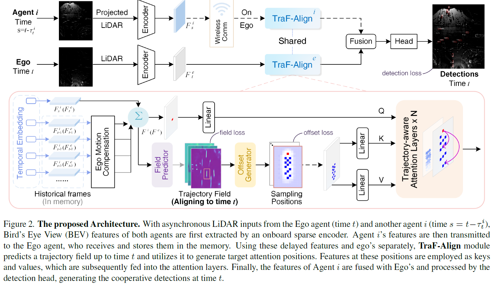

<p align="center">
  <h1 align="center">[CVPR2025] TraF-Align: Trajectory-aware Feature Alignment for Asynchronous Multi-agent Perception </h1>
  <p align="center">
        <a href="https://scholar.google.cz/citations?view_op=list_works&hl=zh-CN&hl=zh-CN&user=joReSgYAAAAJ"><strong>Zhiying Song</strong></a>
    ·
    <a href="https://scholar.google.com.hk/citations?user=EUnI2nMAAAAJ&hl=zh-CN&oi=sra"><strong>Lei Yang</strong></a>
    ·
    <a href="https://scholar.google.cz/citations?user=gPsEbpgAAAAJ&hl=zh-CN"><strong>Fuxi Wen</strong></a>
    ·
    <a href=""><strong>Jun Li</strong></a>
</p>
<p align="center">
  <a href="https://arxiv.org/abs/2503.19391">.svg"></a>
  </p>



**For any questions, please feel free to email me at song-zy24@mails.tsinghua.edu.cn.**

## Abstract
Cooperative perception presents significant potential for enhancing the sensing capabilities of individual vehicles, however, inter-agent latency remains a critical challenge. Latencies cause misalignments in both spatial and semantic features, complicating the fusion of real-time observations from the ego vehicle with delayed data from others. To address these issues, we propose TraF-Align, a novel framework that learns the flow path of features by predicting the feature-level trajectory of objects from past observations up to the ego vehicle’s current time. By generating temporally ordered sampling points along these paths, TraF-Align directs attention from the current-time query to relevant historical features along each trajectory, supporting the reconstruction of current-time features and promoting semantic interaction across multiple frames. This approach corrects spatial misalignment and ensures semantic consistency across agents, effectively compensating for motion and achieving coherent feature fusion. Experiments on two real-world datasets, V2V4Real and DAIR-V2X-Seq, show that TraF-Align sets a new benchmark for asynchronous cooperative perception. 

## Installation

```bash
# Create a conda environment
conda create -n TraF-Align python=3.9.13

conda activate TraF-Align

# install torch, test on cuda 12.0
pip install torch==2.1.2 torchvision==0.16.2 torchaudio==2.1.2 --index-url https://download.pytorch.org/whl/cu121

# install packages
pip install -r requirements.txt

# install spconv, test on spconv 2.1.35
pip install spconv-cu111

# Install bbx nms calculation cuda version
cd models/ops/iou3d_nms && python setup.py build_ext --inplace

```

## Test with pretrained model
We provide the checkpoints of TraF-Align trained on V2V4Real and V2X-Seq in ```checkpoints/```. First set the configs in ```tools/inference.py```, including checkpoint folder path, batch size, delay of Ego vehicle and cooperative agents. Then test them by 
```python
python tools/inference.py
```

## Train your model
Following OpenCOOD, TraF-Align uses yaml file to configure all the parameters for training. To train your own model
from scratch, run the following commands:

```python
python tools/train.py --hypes_yaml ${CONFIG_FILE} 
```
Arguments Explanation:
- `hypes_yaml`: the path of the training configuration file, e.g. `'hypes_yaml/v2v4real/v2v4real_TraF-Align.yaml'`.

Because we use one_cycle lr scheduler, the learning rate is correlated to trained epochs, we do not support train from checkpoints yet.

If you use multiple GPUs, run the following commands:
```python
CUDA_VISIBLE_DEVICES=${gpus} python -m torch.distributed.launch --nproc_per_node=${gpu_number} --use_env tools/train.py --hypes_yaml ${hypes_yaml}
```

Arguments Explanation:
- `gpus`: the visible gpu ids for training, e.g. `'1,2,3,4,5,6,7,8,9'`.
- `gpu_number`: number of gpus, e.g. `9`.
- `hypes_yaml`: the path of the training configuration file, e.g. `'hypes_yaml/v2v4real/v2v4real_TraF-Align.yaml'`.


## Citation
  ```bibtex
@InProceedings{Song_2025_TraF-Align,
    author    = {Song, Zhiying and Yang, Lei and Wen, Fuxi and Li, Jun},
    title     = {TraF-Align: Trajectory-aware Feature Alignment for Asynchronous Multi-agent Perception},
    booktitle = {Proceedings of the IEEE/CVF Conference on Computer Vision and Pattern Recognition},
    year      = {2025},
    pages     = {}
}
```

## Acknowledgment
TraF-Align is build upon [OpenCOOD](https://github.com/DerrickXuNu/OpenCOOD), many thanks to the high-quality codebase.
